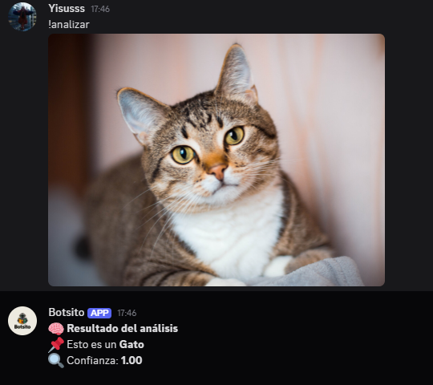
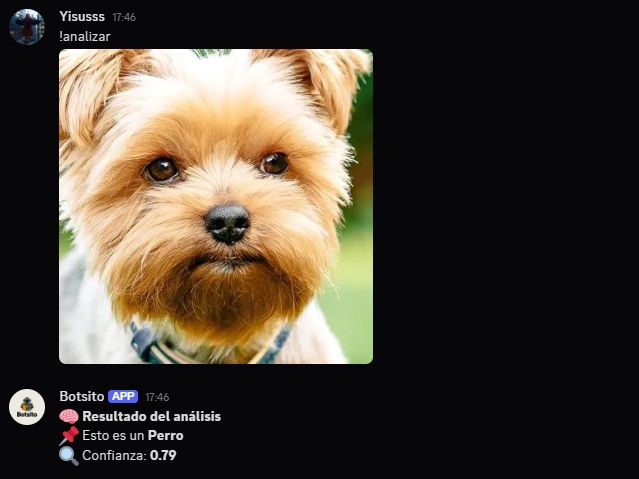

# 🤖 Bot de Discord con Visión por Computador

Bot de Discord que utiliza **Inteligencia Artificial** entrenada con **Teachable Machine**
para **analizar imágenes** enviadas por los usuarios y clasificarlas usando
**Computer Vision**.

---

## 🧠 Tecnologías usadas

- Python 3.10+
- Discord.py
- TensorFlow / Keras
- NumPy
- Pillow (PIL)
- Teachable Machine
- dotenv

---

## 📸 ¿Qué hace el bot?

- Recibe imágenes en Discord
- Analiza la imagen con un modelo de IA
- Devuelve:
  - La **clase detectada**
  - El **nivel de confianza**
    
---
  ## Imagenes
  
  
